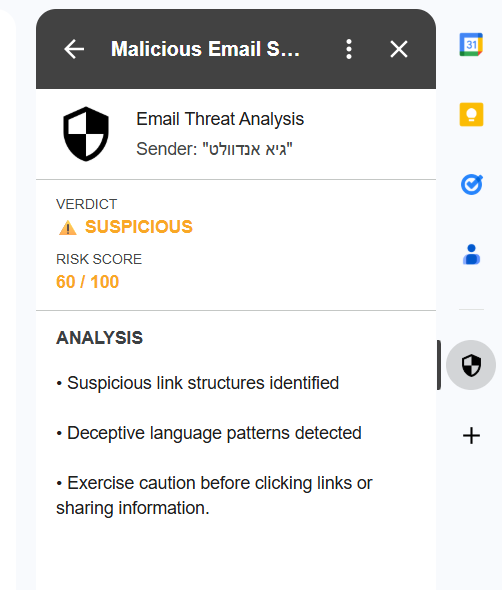
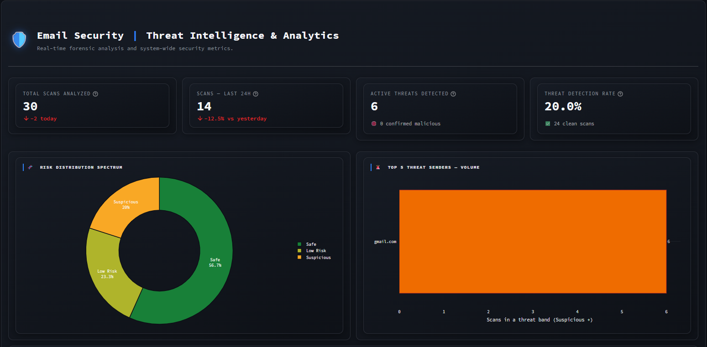

# Malicious Email Scorer: Threat Analysis

A Gmail Add-on that scores any open email for phishing and maliciousness on a 0–100 scale and shows an explainable verdict right inside the inbox. It turns "is this email safe?" from a guess into a deterministic, auditable answer — backed by local heuristics and live threat intelligence.



---

## 1. Getting Started

### One-click setup (recommended)

```bash
chmod +x run.sh && ./run.sh
```

`run.sh` validates your environment, builds and starts the stack, waits until every service is genuinely healthy, and prints a summary with all URLs.

**Prerequisites:**
- **Docker Desktop** running.
- A **`.env` file** — copy the template first: `cp .env.example .env`, then fill in `POSTGRES_*` and (optionally) `VIRUSTOTAL_API_KEY`. The system runs without a VT key; threat-intel calls simply soft-fail.
- *Windows:* run `run.sh` from **Git Bash** or **WSL**, not PowerShell.

The script launches **three services**:

| Service     | URL                          | Role                        |
| ----------- | ---------------------------- | --------------------------- |
| Backend     | <http://localhost:8000/docs> | FastAPI scoring engine      |
| Dashboard   | <http://localhost:8501>      | Streamlit analytics console |
| Database    | `localhost:5432`             | PostgreSQL — history + cache |

Tear everything down with `./run.sh --stop`.

### Deploy the Gmail Add-on

1. Start an ngrok tunnel to the backend: `ngrok http --domain=<your-domain> 8000`.
2. In **Google Apps Script**, create a new project. Paste `apps-script/Code.gs` and the `apps-script/appsscript.json` manifest (enable manifest editing in Project Settings).
3. Set `BACKEND_URL` in `Code.gs` to your tunnel URL.
4. **Deploy → Test deployments → Install**, then open any email — the verdict renders in the sidebar.

---

## 2. System Flow & Architecture

How an email becomes a verdict:

- **Extract** — On open, the Add-on pulls the sender, subject, body, and links, and computes **SHA-256 hashes of attachments client-side** (file bytes never leave Gmail).
- **Transmit** — A single `POST /api/analyze` request goes to the FastAPI backend over HTTPS.
- **Analyze** — The backend sanitizes input, runs local heuristics, and queries **VirusTotal** for every URL and hash — all concurrently via `asyncio.gather`.
- **Score & persist** — Signals are aggregated into a 0–100 score and a 5-band verdict; a PII-safe row (sender domain only) is written to PostgreSQL.
- **Render** — The Add-on shows a color-coded card; the Streamlit dashboard reflects the new scan on its next refresh.

```
                    ┌──────────────────────────────────────────────────┐
                    │              Google Workspace (Cloud)            │
                    │  ┌────────────────────────────────────────────┐  │
                    │  │   Gmail Add-on  (Apps Script, CardService) │  │
                    │  │   - Extract sender / subject / body / URLs │  │
                    │  │   - Compute SHA-256 of attachments         │  │
                    │  └─────────────────────┬──────────────────────┘  │
                    └────────────────────────┼─────────────────────────┘
                                             │  HTTPS POST  /api/analyze
                                             │  (ngrok tunnel in dev)
                                             ▼
        ┌────────────────────────────────────────────────────────────────┐
        │                       Docker Compose Stack                     │
        │                                                                │
        │   ┌──────────────────┐    ┌────────────────────────────────┐   │
        │   │  FastAPI Backend │◄───┤  Streamlit Analysis Dashboard  │   │
        │   │  - Pydantic in   │    │  - reads /api/stats only       │   │
        │   │  - Heuristics    │    │  - 5-band palette mirrors UI   │   │
        │   │  - VT (async)    │    └────────────────────────────────┘   │
        │   │  - Scoring       │                                         │
        │   └──────┬───────────┘                                         │
        │          │                                                     │
        │          ▼                                                     │
        │   ┌──────────────────┐                                         │
        │   │  PostgreSQL 16   │   indicators_cache  +  scans_history    │
        │   │  (named volume)  │   (PII-safe: sender_domain only)        │
        │   └──────────────────┘                                         │
        └────────────────────────────────────────────────────────────────┘
                                             │
                                             ▼
                              External: VirusTotal API v3
                              (URLs and file hashes, cached 24h)
```

| Band       | Score   | Meaning                                  |
| ---------- | ------- | ---------------------------------------- |
| Safe       | 0–20    | No threat indicators.                    |
| Low Risk   | 21–40   | Minor indicators — stay alert.           |
| Suspicious | 41–60   | Caution before clicking or replying.     |
| High Risk  | 61–80   | Likely phishing.                         |
| Malicious  | 81–100  | Do not interact.                         |



---

## 3. Multi-Layered Scoring Engine

The verdict is built from **three independent layers** — each contributes signal, and no single layer is a black box.

- **Layer 1 — Domain Reputation.** Analyzes the sender. Flags **display-name vs. domain mismatch** — e.g. a "PayPal" display name sending from a domain that isn't PayPal's. Word-token matching avoids false hits like `ups` inside `cleanups`.
- **Layer 2 — Mail Content.** Heuristic analysis of the (HTML-sanitized) subject and body: **urgency and deceptive-language patterns**, **suspicious link structures** (IP-as-host, lookalike TLDs, deep subdomains), and **dangerous attachment filenames** (executable and double-extension spoofing).
- **Layer 3 — File & URL Intelligence.** Real-time cross-referencing of every link and attachment hash against **VirusTotal**. A confirmed hit (**≥3 vendors agreeing**) overrides the score to 100; an isolated 1–2 vendor hit adds weighted suspicion without over-reacting.

Results are cached for 24h in PostgreSQL, so repeat indicators cost zero API calls.

---

## 4. Technical DNA

- **Stack** — **FastAPI** (async I/O for concurrent threat-intel lookups), **PostgreSQL** (persistence + indicator cache), **Docker Compose** (one-command orchestration), **Streamlit** (Analysis dashboard).
- **Security** — **Least-privilege OAuth scopes** (read only the currently-open message), **PII-safe logging** (attachment hashes only — never file bytes; sender domain only — never full addresses or content), strict Pydantic input validation.
- **Deterministic logic** — **No-LLM policy.** Scoring is pure rules + threat intel, making every verdict 100% explainable, auditable, and consistent — the same email always scores the same.

---

## 5. Trade-offs & Future Vision

- **Latency vs. Depth** — A strict 5-second timeout caps every VirusTotal call; a slow source is treated as clean to keep the Add-on snappy. Bounded risk: every other layer still fires.
- **Caching: simple now, fast later** — PostgreSQL doubles as the cache today for deployment simplicity. **Redis** is the natural next step for sub-millisecond hot-path lookups.
- **Detection depth** — Header-level **DMARC/DKIM/SPF** verification and a learned classifier on top of the heuristics would extend coverage; both are deferred deliberately, not by oversight.
- **Hardening** — API authentication and per-IP rate limiting are required before any multi-user deployment.
